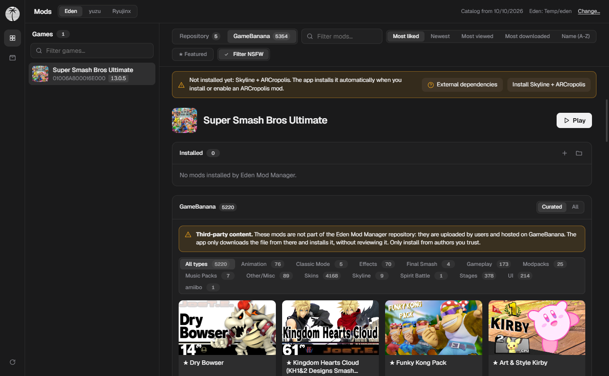

<div align="center">


# Eden Mod Manager

**Browse, install and manage Nintendo Switch mods in Eden, yuzu and Ryujinx.**

Windows, Linux and macOS. Optional NSZ tools.

[](https://github.com/pendiego/Eden-Mod-Manager/actions/workflows/build.yml)
[](https://github.com/pendiego/Eden-Mod-Manager/releases/latest)
[](LICENSE)

[Download](#download) · [Quick start](#quick-start) · [Supported mods](#supported-mods) · [User guide](docs/USER_GUIDE.md)

</div>

## Download

Get the latest build from the [Releases page](https://github.com/pendiego/Eden-Mod-Manager/releases/latest).

| Platform | File | Notes |
|---|---|---|
| Windows | `*-setup.exe` | Installer |
| Windows | `EdenModManager-portable.zip` | No install; stores app data beside the `.exe` |
| Linux | `.deb`, `.AppImage` | Needs WebKitGTK 4.1 |
| macOS | `.dmg` | Apple Silicon; not notarized |

## Quick start

1. Select Eden, yuzu or Ryujinx. Use **Change** if the app needs a different data folder.
2. Select a game from the list.
3. Click **Install** on a mod. Choose a variant if the app offers one.
4. Enable the mod in the emulator under *Configure game → Add-Ons*.

Use **+** in the Installed panel to install your own `.zip`, `.7z` or `.rar` archive.

## Supported mods

- Catalog mods from the official database, TheBoy181, the Switch Mods Wiki Archive and the PT-BR translation pack.
- GameBanana mods. These are third-party uploads and are not reviewed by this app. Browse curated or all mods, filter by mod type (courses, skins, modpacks, etc.), sort by likes, date, views, downloads or name, filter featured community creations, and toggle the adult content filter (enabled by default). The downloads sort ranks the game's 200 most downloaded mods first (GameBanana's index does not expose download counts); the rest follow by likes.
- Standard mod archives with recognized `romfs`, `exefs`, `romfslite`, `romfs_ext` or `cheats` content.
- Mario Kart 8 Deluxe archives with raw `Audio`, `Course`, `Driver`, `Kart` or `UI` folders.
- Super Smash Bros. Ultimate ARCropolis mods for Eden and Ryujinx. Yuzu is not supported for ARCropolis.

Archive extensions do not guarantee a supported layout. TKCL containers with a filename ending in `_tkcl.zip` are skipped. Other games can require loaders that the app does not provide.

The app also includes optional tools to compress NSP/XCI files and decompress NSZ/XCZ files. Games stored in compressed format display an NSZ indicator and direct shortcut to decompress them, and game update packages found in your game folders are automatically registered in the emulator.

## User guide

See the [User Guide](docs/USER_GUIDE.md) for setup, mod installation, supported layouts, Smash dependencies and troubleshooting.

## Screenshots

<details>
<summary>Open the screenshot gallery</summary>

<p align="center">
  
</p>

<p align="center">
  
</p>

<p align="center">
  
</p>

<p align="center">
  
</p>

| Your games | NSZ compressor |
|---|---|
|  |  |

| App menu | Settings |
|---|---|
|  |  |

<p align="center">
  
</p>

</details>

## Build from source

Requirements: Node.js 22+, stable Rust and the [Tauri prerequisites](https://tauri.app/start/prerequisites/). On Debian or Ubuntu:

```sh
sudo apt install libwebkit2gtk-4.1-dev libgtk-3-dev librsvg2-dev patchelf
npm ci
npm run tauri dev
npm run tauri build
```

Run checks with `npm run check` and `cargo test --manifest-path src-tauri/Cargo.toml`.

## Credits

- Mod catalog data: [Switch-Emulator-Mod-Database](https://github.com/ADEMOLA200/Switch-Emulator-Mod-Database), [TheBoy181](https://github.com/theboy181/switch-ptchtxt-mods) and [Switch Mods Wiki Archive](https://github.com/amakvana/Switch-Mods-Wiki-Archive).
- Community mods: [GameBanana](https://gamebanana.com).
- PT-BR translations: [staticpiratex/Traducoes-SWITCH-PTBR](https://github.com/staticpiratex/Traducoes-SWITCH-PTBR).
- Compression: [nsz](https://github.com/nicoboss/nsz). Cover art: [nlib](https://api.nlib.cc).

Eden Mod Manager is not affiliated with Nintendo or any emulator project. Use it only with games and keys you legally own.

## License

Licensed under the [MIT License](LICENSE).
